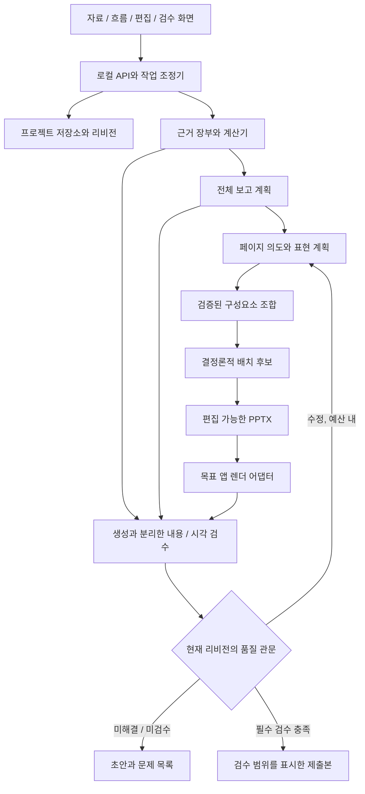

# ADR: 품질 중심 보고서 파이프라인

상태: 목표 구조 채택. Q3b의 새 도식 AI 후보 이후 Q4a의 파일별 수동 검수 기록과 현재성 관리를 추가한다. 기존 단계 기록은 아래에 보존하며 현재 구현/검증 경계는 [Q4a 인계](../handoffs/2026-09-29-q4a-review-records-handoff.md)를 따른다. 실제 목표 PowerPoint와 독자 품질은 미검증이다. 2026-09-29 정정 사유는 과거 Q3b 첫 단위의 상태 표기를 갱신하고 수동 기록과 독립 검수/제출 승인을 구분하기 위해서다.
날짜: 2026-09-12. 근거: 사용자가 품질 진단에 동의하고 설계 보완과 개발을 승인했다.

## 배경과 제약

현재 단일 템플릿/페이지 계약은 편집과 결정론적 배치에는 유리하지만 차트와 도식, 의미별 강조, 복합 표현을 제한한다. 형식/분량 검사만으로 보고서의 의미와 실제 화면을 검수할 수 없다. 로컬 우선, 편집 가능한 PPTX, 저장 안전성, API 보호, AI 전송 동의와 사용량 기록은 유지한다.

## 대안과 결정

| 대안 | 장점 | 한계 | 결정 |
|---|---|---|---|
| 기존 슬롯과 템플릿만 확대 | 작은 변경, 기존 코어 재사용 | 논리와 근거 검수, 복합 구성 문제를 해결하지 못함 | 호환 경로로 유지 |
| 에이전트가 임의 코드와 좌표 생성 | 표현 자유도 | 안전성, 편집 계약, 재현성, 수정/검수 비용 위험 | 제품 기본 경로로 채택하지 않음 |
| 의미 계획 + 검증된 구성요소 + 결정론 배치 + 독립 검수 | 판단력과 일관된 출력의 결합 | 중간 모델과 검수 체계 개발 필요 | 채택 |

더 강한 모델만으로 해결된다는 가설은 미검증이다. 모델 교체는 블라인드 비교의 실험 변수이며 구조적 제약을 대신 해결하지 않는다. 검수 루프가 과도한 비용과 지연을 만들 수 있으므로, 무한 반복이 아니라 승인된 예산과 제한된 수정으로 운영한다.

## 목표 구성

## 책임 경계

| 구성요소 | 입력 / 출력 | 책임과 금지 |
|---|---|---|
| 근거 장부 | 자료 위치, 값, 단위, 기간, 주체 / Evidence | 원문 위치와 리비전을 유지. 모델 문장을 출처로 승격하지 않음 |
| 결정론 계산기 | 승인된 입력과 산식 / DerivedValue | 재계산, 단위/분모 검사. 근거 없는 숫자 생성 금지 |
| StoryPlanner | Brief + Evidence / StoryPlan | 보고 질문, 핵심 주장, 논리 순서, 페이지 역할, 미확인 사항 |
| PagePlanner | StoryPlan + Evidence / SlideIntent | 표현 선택 이유, 비교 기준, 관계, 의미별 강조 |
| Composer/Layout | SlideIntent + Profile / RenderPlan | 승인된 구성요소와 후보 배치. 무제한 좌표/실행 코드 금지 |
| Renderer | PPTX + 앱/폰트 환경 / 페이지 이미지와 환경 기록 | 대상 환경을 명시. 렌더 실패는 검수 미수행 |
| Critics | 전체 내용 + 근거 + 실제 페이지 / Findings | 생성자와 다른 호출/컨텍스트로 검수. 자기 칭찬이나 점수만으로 통과 금지 |
| QualityGate | 리비전 + Findings + 검수 범위 / 상태 | 미수행, 미해결, 낡은 판정을 통과로 승격하지 않음 |
| RepairCoordinator | Findings + Budget / 제한된 변경 | 원문/수동 수정 보존, 변경 영향에 따른 재검수, 상한에서 중단 |

## 목표 데이터 계약

아래는 Q2 이후의 목표 계약이다. Q2a/Q2b/Q2c는 그중 최소 부분을 아래 실제 계약대로 구현했으며 표 전체가 현재 HTTP/Deck 스키마에 존재하지는 않는다.

| 모델 | 핵심 필드 |
|---|---|
| ReportBrief | audience, decision_question, report_type, reading_profile, constraints |
| Evidence | id, source_id, source_revision, locator, value, unit, period, entity, denominator, excerpt |
| Claim | id, statement, kind(fact/inference/proposal/unknown), evidence_ids, derivation, caveats |
| StoryPlan | brief_revision, main_answer, chapter_order, claim_ids, unanswered_questions |
| SlideIntent | chapter_id, purpose, takeaway, evidence_ids, representation, relationships, emphasis_roles |
| Component | typed table/chart/diagram/text/image, semantic bindings, layout_variant |
| RenderContext | renderer/version, fonts/assets fingerprints, page_size, reading_profile |
| ReviewRun | input/artifact fingerprints, coverage, findings, reviewer/model receipt, rules version, usage |
| Finding | code, severity, scope/chapter/component, evidence, requested_fix, state |
| RepairBudget | max_calls, max_rounds, deadline, known_cost_limit, reserved_review_budget |

자유 형식 문자열에 전체 의미 계획을 숨기지 않는다. 주장의 근거 링크, 차트 데이터와 도식 연결 관계는 구조화한다. 표현 모델은 숫자 출처나 불확실성을 잃지 않아야 한다.

### Q2a 실제 계약 (2026-09-12)

- 기존 `generate/structure` 요청의 선택적 `brief`가 `ReportBrief`다. 생략하면 레거시 응답 스키마로 호출한다. 계획 경로도 한 번의 생성과 형식 오류 재시도 최대 1회이며 동의/사용량 계약을 공유한다.
- 저장 위치는 `Structure.story_plan`이다. 기존 `StructureResult.structure`와 Deck 왕복에 포함한다. `StoryPlan` 안에 brief, evidence, claims, answer_claim_ids, chapters, unanswered_questions와 input_fingerprint를 둔다.
- 핵심 답변은 별도 자유 문자열 `main_answer` 대신 `answer_claim_ids`로 연결한다. `chapters` 목록 순서가 장 순서이며 각 항목은 chapter_id, role, claim_ids를 가진다. 현재 별도 brief_revision 필드는 없다.
- Evidence의 source_id는 로컬 추출 자료명이고 locator는 1부터 시작하는 행 범위다. excerpt와 source_revision은 코드가 해당 범위와 UTF-8 텍스트 SHA-256으로 만든다. 원본 XLSX 셀 좌표 대신 추출본의 행을 가리키며 추출본에 있는 셀 표기는 발췌에 보존된다. 모델의 자료명/원문 필드에는 문구 정규화를 적용하지 않는다.
- 사실의 근거 유무, ID 중복/참조, 답변과 본문 장의 연결, 추정/미확인의 조건, 원문 행 범위와 value 문자열의 포함 여부를 검사한다. 단위/기간/분모의 의미, 주장이 발췌로 입증되는지, 계산과 요약의 의미 정합성은 검사하지 않았다. derivation/DerivedValue는 이번 계약에 없다.
- input_fingerprint는 계획 내용, 제목/독자/보고 유형, 구조안과 전체 자료 집합에 바인딩한다. 저장/편집/복원은 계획을 보존하되 달라진 입력에서 장 생성/축약은 AI 호출 전에 409로 거절한다. 슬라이드 슬롯, 발표자와 프리셋 편집은 이야기 입력을 바꾸지 않는다. 이 바인딩은 검수 통과나 인증 수단이 아니다.

### Q2b 실제 계약 (2026-09-12)

- `Evidence.metric_basis`는 선택적 비교 입력이다. definition, unit, entity, period와 denominator를 가진다. 기존 자유 문자열 unit/period/entity/denominator는 원문 메타데이터로 보존하며 비교 판정에 혼합하지 않는다. 모델이 분류한 두 표현의 일치나 원문 의미를 자동 검증한 것은 아니다.
- `MetricPeriod`는 start/end(ISO 날짜, 양끝 포함), grain(month/quarter/year/point/custom), aggregation(sum/average/ratio/point/other), coverage(complete/partial/unknown)다. 완결된 달력 월/분기/연과 단일 시점만 지원한다. 월/연을 고정 일수로 환산하지 않으며 부분 기간, 기타 집계, 범위 미확인에는 사유를 반환한다.
- `MetricDenominator`는 kind(none/population/unknown)와 definition이다. 해당 없음과 미확인을 구분하며 비율은 모집단 정의가 필요하다. 모집단 정의의 동의어 판정, 표본 구성과 규모에 대한 통계적 비교 가능성 검수는 수행하지 않는다.
- `StoryPlan.comparisons`는 id, claim_id, left_evidence_id, right_evidence_id, axis(entity/period)를 가진다. 두 근거는 같은 주장에도 연결돼야 한다. 존재하지 않는 참조, 중복 비교 ID, 동일 근거 쌍은 형식 오류다. 등록하지 않은 비교 주장을 자동으로 탐지하지는 않는다.
- `comparison_results`는 코드가 생성하며 모델 응답 스키마에는 없다. 각 결과에는 comparison_id, rule_version(q2b-v1), status와 reasons(code/field/message/evidence_id)가 있다. 계획을 생성하거나 저장 파일/API 입력에서 읽을 때도 결과를 다시 계산한다. 변경된 비교 입력은 저장되지만 기존 fingerprint로 장 생성/축약을 요청하면 409다.
- definition/unit/denominator는 정확히 일치해야 한다. entity 비교는 서로 다른 주체와 동일 기간을, period 비교는 동일 주체와 같은 집계/기간 단위의 비중첩 기간을 요구한다. 알려진 불일치가 있으면 incompatible, 불일치 없이 정보 누락이나 미지원 조건이 있으면 insufficient_metadata, 모든 입력 조건이 맞으면 compatible이다. 누락과 불일치가 함께 있으면 모든 사유를 남긴다. compatible은 입력 조건의 일치이며 검수 통과가 아니다.
- 새 계획은 q2b-v1이며 Deck 버전은 1이다. q2a-v1의 fingerprint에서는 당시 없던 metric_basis/comparisons/comparison_results를 제외한다. Q2a 계획에 새 계약을 넣어 이 제외 규칙을 우회하면 모델 검증에서 거절한다. 실제 변경 전 저장본을 회귀 픽스처로 보존했다.
- 생성/승인/저장/복원/편집/장 생성/축약과 화면에 비교 계약을 연결했다. 불가/정보 부족 비교를 직접적인 우열, 증감이나 차트 근거로 쓰지 말라는 지침을 전달한다. 생성 문장의 준수 여부는 독립적으로 검수하지 않으며, Q1a 품질 기록의 의미/근거/시각 검수는 계속 not_run이다. 검사 대상 0건은 미검사로 표시한다.

### Q2c 실제 계약 (2026-09-13)

- `StoryPlan.derivations`는 id, comparison_id, operation(difference/percent_change)을 가진다. 연결된 비교의 claim_id를 통해 주장에 연결한다. Claim 자체의 derivation 필드는 아직 없으며 결과를 Evidence로 재등록하지 않는다. 자유 수식/상수/연쇄 계산과 모델이 보낸 derived_values는 응답 스키마에서 거절한다.
- 비교의 left_evidence_id는 대상값, right_evidence_id는 기준값이다. 차이는 대상값 - 기준값, 증감률은 (대상값 - 기준값) / 기준값 × 100이다. Q2b 비교가 compatible이어야 계산한다. 증감률의 기준값은 양수이며 기간 비교에서는 대상 기간이 기준 기간보다 뒤여야 한다. 같은 기간 주체 비교의 증감률은 오른쪽 주체를 기준으로 한 상대 차이다.
- 숫자는 원문의 value 전체를 파싱한다. ASCII 부호/숫자, 정수부가 있는 소수, 올바른 3자리 쉼표와 metric_basis.unit에 정확히 맞는 접미사를 지원한다. 단위 환산은 하지 않는다. 최대 24자리(소수 6자리), 값 문자열 128자다. 숫자 일부 선택, 주변에 이어진 다른 단위/범위/'약' 표시와 모호한 표기는 사유를 반환한다. 이 검사는 일반 자연어 수치 해석기가 아니며 숫자와 지표의 의미 연결을 보증하지 않는다.
- 분모 none인 절대값의 차이/증감률과 population이 명시된 aggregation=ratio, unit=%의 차이를 지원한다. 후자는 퍼센트포인트다. 비율의 상대 증감률, 임의 비율/통화 환산, 분모 수치 재계산은 미지원이다.
- `derived_values`는 derivation_id, rule_version(q2c-v1), status(computed/blocked), formula, value, unit, rounded와 reasons(code/message/evidence_id)를 반환한다. 값은 문자열이며 프런트에서 숫자로 변환하지 않는다. Fraction으로 정확한 산술을 수행하고 Decimal로 소수 최대 6자리 ROUND_HALF_UP 표시를 만든다. 반올림 여부를 원래 유리수와 대조하고 -0은 0으로 표시한다. 계산 불가에서는 value/unit/rounded를 null로 둔다.
- 저장/API 입력을 읽을 때 결과를 재계산하며 파일의 성공 상태/숫자/단위를 신뢰하지 않는다. 산식/근거/조건 변경은 저장되지만 기존 fingerprint로 장 생성/축약을 요청하면 외부 호출 전에 409다. 신규 계획 q2c-v1과 Deck 버전 1을 사용하며, q2a/q2b fingerprint에서는 당시 없던 derivations/derived_values를 제외한다. 옛 버전에 비어 있지 않은 계산 필드를 넣는 우회는 거절한다. 두 실제 변경 전 저장본을 회귀 검사한다.
- 승인/저장/복원/편집/undo/redo/장 생성/축약/화면까지 연결했다. 프롬프트에 계산 결과/반올림/불가 사유를 전달하고 수치 존재 경고는 해당 장 또는 핵심 답변에 연결된 computed 값만 추가로 허용한다. 다른 장의 계산/실패 결과는 경고 근거로 쓰지 않는다. 이 경고는 여전히 숫자 존재 검사이며 부호/단위/문장 의미의 정확성을 검수하지 않는다.
- 합성 저장본 하나를 백엔드 계산 검사와 프런트 표시 검사에서 함께 사용한다. 계산 대상 0건과 대응 결과 부재는 미계산이다. Chrome에서 정상/불가/반올림 3개 사례를 확인했으며 Q1a의 의미/근거/시각 품질 판정은 계속 not_run이다.

## 상태와 무효화

사용자 상태는 초안, 수정 필요, 검수 중, 검수 통과, 검수 만료로 구분한다. 저장/생성 성공과 분리한다. 각 검수의 상태는 passed/failed/not_run으로 유지하며 검수 대상 수와 실패 수를 기록한다.

- 원문/수치/주장 변경: 근거와 관련 페이지, 전체 요약 검수를 무효화한다.
- 표현/폰트/크기/배치 변경: 해당 페이지의 시각 검수와 목표 앱 표시 검수를 무효화한다.
- 읽기 환경, 폰트/이미지 또는 렌더러 변경: 영향받는 화면 검수를 무효화한다.
- 내용/레이아웃 영향과 무관한 관리 메타 변경: 영향 범위를 구분하되 판정의 바인딩을 조용히 생략하지 않는다.
- 최종 출력 파일의 해시가 바뀌면 해당 출력의 검수 결과를 재사용하지 않는다.

제출본 관문은 서버가 현재 입력과 출력, 검수 범위, 치명적 미해결 사항을 재계산한다. 클라이언트가 보낸 approved=true나 점수를 신뢰하지 않는다. 예외 허용은 범위와 이유를 남기며 자동 검수 통과와 구분한다.

## 배치와 표현

읽기 환경별 프로필은 의미 역할의 크기, 최소 가독성, 공통 기준선, 간격, 색 역할과 이미지 정책을 가진다. 특정 pt와 색 개수를 보편 정답으로 고정하지 않는다. 차트 축, 단위, 분모와 기간은 데이터 계약에서 나온다. 관계도의 화살표는 실제 관계를 표현하며 근거 없는 인과를 암시하지 않는다.

분량이 넘치면 배치 후보 변경, 구성요소 재배치, 페이지 분리, 부록 이동, 의미 보존 축약을 검토한다. 필수 검수 항목인 단위/조건/불확실성을 삭제해 맞추지 않는다. 이미지가 필요 없으면 사용하지 않는다.

## 호출과 실행 보안

기존 프로바이더 격리와 동의 관문을 유지한다. 제품 소유의 버전 관리된 계획/검수 지침을 사용하고 전역 CLAUDE.md/스킬을 무제한 로드하지 않는다. 자료 안의 지시문을 실행하지 않는다. 임의 셸, 외부 URL, 비밀 키 접근을 모델 출력으로 허용하지 않는다.

긴 작업은 향후 Job 단위로 취소/재개하고 승인된 리비전에 바인딩한다. 큐에 넣기 전에 동의와 예산을 확인하고, 각 호출 전에 취소/리비전/잔여 예산을 다시 확인한다. 로컬 검수와 외부 모델로 페이지 이미지를 보내는 검수는 별도 동의 범위다. 비용 미계측은 0원으로 간주하지 않는다.

## 단계적 호환

Q1a는 Deck와 기존 HTTP 응답을 변경하지 않는다. export 함수에 키워드 전용 final 옵션을 더하며 기본 경로는 초안이다. quality.py가 구조 누락과 기존 용량 경고를 평가하고 미구현 검수는 not_run으로 남긴다. 결과는 PPTX와 같은 버전의 .quality.json에 기록하며, 입력/렌더 계획의 해시와 실제 PPTX의 해시를 포함한다. 최종 승인 API는 아직 없다.

Q2a에서 선택적 계획 메타의 왕복과 편집 보존, OpenAPI/TS/모의 응답의 동시 갱신을 구현했다. schema_version은 1을 유지한다. Q3의 복합 표현은 레거시 어댑터로 기존 템플릿을 수용하고 기존 deck.json을 자동 덮어쓰지 않는다. 의미가 달라지는 스키마 전환에는 명시적 백업/마이그레이션과 사용자 승인을 요구한다.

Q1a의 직접 CLI 내보내기는 서버의 프로젝트 잠금을 공유하지 않았다. 2026-09-13 Q1b 두 번째 단위에서 버전 선택과 파일 게시에 출력 폴더 공통 잠금을 추가했다. sidecar 게시 후 PPTX 게시가 실패하면 남은 버전 번호는 재사용하지 않는다. 덱/원문 편집 전체의 프로세스 간 잠금은 이 변경에 포함하지 않는다.

## 결과와 재심 조건

기존 코어를 보존하면서 품질 판단 범위를 확장할 수 있지만, 이 구조만으로 품질 향상이 입증되는 것은 아니다. 검수자의 오판, 오류를 반복하는 수정 루프, 과도한 지연, 잘못된 차트 선택과 환경 차이가 남는다. Q5의 사람 판정과 최저 품질 페이지, 보류율, 비용을 보고 범위와 방법을 다시 정한다.

## Q2d 실제 계약 (2026-09-13)

- `pipeline/numeric_review.py`가 Q2c 계산에서 비교의 대상/기준, 부호/단위, 기간/분모와 반올림을 담은 `NumericExpression`을 만든다. 계산 ID, 주장 ID와 두 근거 ID로 역추적한다. 같은 text가 여러 산식에 대응하면 연결을 임의 선택하지 않는다.
- 기준 문구는 장 생성과 축약의 `numeric_expressions` 문맥에 전달한다. 보고에 적합할 때 사용하고, 일치 점수를 높이기 위해 문구를 억지로 넣지 않도록 지시한다. 생성 스키마나 기존 슬롯은 변경하지 않는다.
- `POST /api/projects/{name}/review/numbers`는 현재 편집 중인 Deck을 받는 읽기 전용 로컬 API다. 기존 앱 헤더를 요구하며 AI 제공자/전송 동의/AI 호출은 사용하지 않는다. 기존 자료 용량 한도를 적용한다.
- 계산은 입력에서 재계산한다. 현재 자료와 계획 fingerprint를 확인하고, 별도로 모든 근거의 source_revision/원문 행 범위/excerpt를 파일 내용과 대조한다. 입력 해시는 서명이 아니므로 클라이언트가 해시를 새로 계산해도 원문 대조를 건너뛸 수 없다.
- 실제 슬라이드의 슬롯 문자열, 공통 eyebrow/subtitle와 본문 장 제목 중 숫자가 있는 텍스트 칸을 검사한다. 한 자리/비ASCII 십진 숫자를 포함하고 표지 날짜, 간지 번호, 템플릿/색 역할은 제외한다. 칸 전체가 유일한 기준 문구와 일치해야 `matched`다. 일부분의 숫자/문구 일치, 다른 문체와 원문 수치는 `unlinked_expression`, 같은 문구의 산식 중복은 `ambiguous_expression`이다.
- 대상 0건, 계획 없음/낡음, 원문 연결 불일치와 사용 가능한 계산 없음은 `not_run`이며 evaluated=0이다. 수치가 있는 칸 수와 미해결 수를 별도로 표시한다. 정상 대조에서는 텍스트 칸 N 중 일치 M과 미해결 N-M을 반환한다. 의미 검수 상태는 항상 `not_run`이다.
- 보고서 fingerprint는 현재 덱, 소스별 내용 해시와 규칙 버전에 묶는다. 결과는 덱/스냅샷/사용량에 저장하지 않는다. 화면은 편집/undo/redo/프로젝트 이동/복원/언마운트에 결과와 진행 중 요청을 무효화하고, 다른 입력에 대한 늦은 응답을 버린다. 별도 앱의 원문 변경은 재검사 시 반영된다.
- Deck 버전 1과 q2a/q2b/q2c 저장본은 유지한다. Q1a의 evidence/narrative/visual 미수행과 제출본 차단도 유지한다. 기존 숫자 존재 경고는 별도로 남아 있다. Q2d 종료 시 이월했던 품질 기록/내보내기 통합은 아래 Q1b 첫 단위에서 구현했다.
- 지원 범위는 명시적 기준 문구의 동일성이다. 원문 메타데이터의 진실성, 자유로운 자연어의 의미, 숫자를 글자로 쓴 표현, 전체 요약 정합성과 실제 보고서 품질을 판정하지 않는다. 자동 교정/부분 재계획과 실제 AI/PowerPoint/독자 검수는 미구현 또는 미검증이다.

## Q1b 첫 단위 실제 계약 (2026-09-13)

- `assess_quality(..., sources=...)`가 Q2d 대조를 직접 다시 실행한다. 화면에서 이전에 검사한 결과나 클라이언트의 통과 판정을 입력으로 받지 않는다. gate_version은 `preflight-v2`이며 원문 해시를 포함한 수치 대조 fingerprint를 품질 fingerprint에도 포함한다.
- `QualityReport.numeric_review`는 수치 상세 전체를 보존한다. `checks.numeric_expressions`는 matched를 해당 항목의 passed, needs_review를 failed, 미수행을 not_run으로 표시한다. 미수행은 evaluated/failed=0이며 미연결 칸 수는 상세 unresolved에 남는다. evidence/narrative/visual/representation/target_renderer는 계속 not_run이다.
- 과거 `preflight-v1` 기록은 numeric_review=None으로 읽으며 검사 결과를 만들어 넣지 않는다. Deck와 StoryPlan 저장 버전, 기존 입력 파일과 과거 PPTX/점검 기록은 변경하지 않는다.
- HTTP 내보내기는 프로젝트 잠금 안에서 덱과 원문을 읽고 같은 입력으로 PPTX와 점검 기록을 게시한다. 성공 응답은 기존 path와 추가 quality_path/quality를 담으며 quality는 게시한 JSON과 같다. `?final=true`는 CLI `--final`과 같은 관문에서 422로 거절한다. 오류 응답의 문자열 detail은 유지한다.
- CLI quality/export는 덱 옆 `sources/`를 읽는다. 숨김 파일 제외와 UTF-8 BOM/cp949 디코딩을 웹 저장소와 맞춘다. 폴더 없음은 빈 자료이며 읽기/디코딩 실패는 오류다. CLI는 기본 프리셋과 덱의 덮어쓰기를 사용하므로 웹의 전역 프리셋이 다르면 품질 fingerprint도 달라질 수 있다.
- 화면은 '내보낸 초안'의 기록으로 검사 수, 미수행 사유와 확인 필요 문구를 보여 준다. 저장 대기 중인 편집은 기존 플러시가 끝난 뒤 내보낸다. 이후 편집본의 현재 판정으로 표시하지 않는다.
- 버전별 파일 보존과 기존 단일 웹 프로세스 잠금은 유지한다. 웹/CLI 간 잠금, 다중 프로세스 게시 안전성, 전체 검수 이력 API/UI와 외부 원문 변경 감시는 이번 단위에 포함하지 않는다. 게시 후 다른 프로그램에서 수정한 PPTX의 재검사도 별도다.

## Q1b 두 번째 단위 실제 계약 (2026-09-13)

- `export_deck_data`에 출력 폴더 단위 공통 잠금을 둔다. 웹, 직접 exporter와 CLI의 기본/사용자 지정 출력 폴더가 같은 경로에서 경쟁한다. POSIX는 `flock`, Windows는 offset 0의 1바이트 `msvcrt.locking`을 사용한다. 잠금 파일은 빈 `.slidecaptain-export.lock`이며 삭제하거나 PID로 만료 판정하지 않는다.
- 웹 프로젝트 잠금 다음 출력 잠금을 잡는다. 렌더와 품질 기록 작성은 출력 폴더의 고유 임시 디렉터리에서 먼저 수행하고, 버전 선택부터 두 파일 게시까지 출력 잠금을 유지한다. 폴더별 잠금이라 다른 출력 폴더를 막지 않는다. CLI와 외부 편집기의 입력 읽기 전체를 트랜잭션으로 만드는 것은 별도 범위다.
- 품질 기록과 PPTX 양쪽의 최대 버전을 사용하며 제목은 정확히 일치해야 한다. 완성한 임시 파일의 hard link를 품질 기록, PPTX 순서로 생성하므로 목적지 경로를 덮어쓰지 않는다. 미지원 파일 시스템은 오류를 반환한다. 부분 복사나 기존 파일 교체로 우회하지 않는다.
- 첫 게시 실패는 결과를 남기지 않는다. 두 번째 게시 실패나 그 사이 강제 종료는 품질 기록만 남길 수 있으며 다음 버전에서 건너뛴다. 두 경로의 생성은 하나의 원자적 연산이 아니므로 파일 쌍의 존재만으로 일치를 판단하지 않고 기록의 artifact_sha256을 대조해야 한다.
- 성공/예외 때 명시적으로 해제하고 파일 핸들을 닫는다. 강제 종료는 OS가 잠금을 해제한다. 숨김 임시 폴더가 남을 수 있으나 다른 활성 요청의 폴더를 삭제하지 않는다. 잠금 대기는 최대 5초이며 초과하면 웹 409/CLI 종료 코드 1, 그 밖의 게시 OSError는 웹 422/CLI 종료 코드 1로 알린다. HTTP 문자열 detail과 성공 응답 모델은 유지한다.
- macOS 별도 프로세스/스레드와 실제 HTTP+CLI로 확인했다. Windows 구현은 아직 실기기/새 CI에서 검증하지 않았다. 네트워크 드라이브/동기화 프로그램/잠금 파일 삭제/구버전 앱 동시 실행과 전원 차단 내구성은 보장 범위가 아니다. 두 번째 단위 종료 당시 전체 검수 이력과 현재 자료 대비 유효성 표시는 후속 범위였으며 아래 세 번째 단위에서 구현했다. 자세한 게시 실패 조건과 공식 API 근거는 [단위 계획](../plans/2026-09-13-q1b2-export-publication.md)을 따른다.

## Q1b 세 번째 단위 실제 계약 (2026-09-13)

- `GET /api/projects/{name}/exports`는 offset/limit 목록, 같은 경로의 `/{export_id}`는 상세다. 기본 20개, 최대 100개이며 품질 기록/PPTX 이름의 합집합을 실제 파일 수정 시각으로 정렬한다. 선택한 페이지의 파일만 해시 대조한다. 제목 변경 전 버전과 유효한 괄호/점 제목을 보존하고 임시 파일은 포함하지 않는다.
- `record_status`, `artifact_status`, `input_status`는 독립 축이다. 읽을 수 있는 저장 결과만 `quality`로 제공한다. 원시 JSON의 gate_version/해시 형식을 검사하고 중복 키, 8 MiB 초과 기록과 손상 데이터를 거절한다. preflight-v1은 읽되 현재 원문 포함 식별값과 비교하지 않는다. 알 수 없는 버전이나 없는 artifact 해시는 확인 불가이며 기본값으로 복구하지 않는다.
- 상세/목록마다 기존 프로젝트 잠금 안에서 현재 deck/preset/sources로 품질 입력 식별값을 한 번 계산한다. 덱/자료 읽기 실패는 current_input_error와 unavailable로 나타내고 이력 자체는 계속 읽는다. exports가 없으면 생성 없이 빈 목록이며, 읽기 실패를 빈 목록으로 숨기지 않는다. 이력 GET의 성공/오류 응답은 `Cache-Control: no-store`다.
- 조회는 게시 잠금을 만들지 않으며 덱/원문/스냅샷/사용량/내보낸 파일을 변경하지 않는다. 파일의 장치/inode/크기/mtime/ctime 등을 열기 전후와 파일 쌍 재대조 때 확인하고 PPTX SHA-256은 스트림으로 계산한다. 변경이나 교체 감지 시 일치를 선언하지 않는다. 이는 관측 시점의 확인이며 외부 편집 전체나 두 파일 게시를 단일 트랜잭션으로 만들지 않는다.
- POSIX에서는 exports 디렉터리를 `O_DIRECTORY | O_NOFOLLOW`로 열고 모든 자식 접근을 해당 fd에 고정한다. 파일/exports 심볼릭 링크와 비정규 파일은 거절한다. 경로를 외부 디렉터리로 잠깐 바꿨다가 되돌려도 외부 내용을 읽지 않는 회귀를 추가했다.
- Windows는 네이티브 디렉터리 핸들을 유지하고 reparse point를 거절한다. 이름 변경 제한만으로 junction 교체 전체를 막았다고 보지 않는다. 실제 읽을 파일 핸들과 목록 항목을 `GetFinalPathNameByHandleW`로 확인해 최초 디렉터리 핸들의 직접 자식 경로와 일치할 때만 사용한다. 이 분기는 코드/모의 경계 검사만 수행했고 Windows 전용 실경로 테스트는 Mac에서 미실행이다. 공식 근거는 [Python dir_fd 지원](https://docs.python.org/3.13/library/os.html#os.supports_dir_fd), [CreateFileW](https://learn.microsoft.com/en-us/windows/win32/api/fileapi/nf-fileapi-createfilew), [GetFinalPathNameByHandleW](https://learn.microsoft.com/en-us/windows/win32/api/fileapi/nf-fileapi-getfinalpathnamebyhandlew)다.
- 프런트는 저장 당시 결과를 공통 점검 표로 표시하되 기존 내보내기 성공 문구는 재사용하지 않는다. 프로젝트 변경/재조회/선택 변경 뒤 늦은 응답은 무시한다. 현재 덱 복구가 필요해도 과거 이력에 접근한다. 일반 복구 화면을 처리 중일 때 이력 탭은 비활성화한다.
- 자료 본문의 수동 저장 기준을 보존한다. 화면 이탈은 보고 정보 저장 전후로 미저장 본문을 확인하며, 자료 이동/추가/가져오기도 미저장 본문을 버리지 않는다. 자료 읽기/저장 응답은 해당 요청 순번과 화면 소유권을 확인하고 저장 중 입력/중복 저장은 차단한다. 성공한 화면 전환에서는 앞선 이탈 오류를 해제한다.

검증 결과와 미완료는 [Q1b 세 번째 단위 인계](../handoffs/2026-09-13-q1b3-export-history-handoff.md)를 따른다. Deck/StoryPlan/QualityReport 저장 버전과 기존 내보내기 응답은 바꾸지 않았다. 이력의 일치 상태가 내용/시각 검수와 제출 승인을 대체하지 않는다.

## Q3a 실제 계약 (2026-09-13)

`models/diagram.py`의 독립 `DiagramSpec(q3a-v1)`과 `parse_diagram_spec(payload, evidence=...)`를 구현했다. 모든 모델 계층은 미정의 필드와 잘못된 자료형을 거절한다. 노드 2~12개, 관계 1~24개, 평문 내용 500자와 관계 라벨 120자를 상한으로 두며 이는 배치 성공이나 가독성 보증이 아니다.

노드/관계 ID와 관계 방향, 사실/추정/제안/미확인의 구분을 보존한다. 사실 노드와 flow/reference 관계는 자기 근거 ID가 필요하고 명시적 proposal은 무근거를 허용한다. 기존 Evidence 장부의 해시/위치 형식과 ID 존재를 확인한다. 원문 파일의 현재성이나 그 근거가 관계를 실제로 뒷받침하는지는 검사하지 않는다.

지원 파서는 JSON 중복 키를 거절하고 중첩 모델의 검증 우회 편집도 다시 검사한다. 독립 리뷰에서 발견한 model_dump의 미정의 필드 손실은 Diagram 모델 직접 재검증과 Evidence 원래 필드 보존으로 수정했다. 반환 객체의 후속 편집은 사용 전에 다시 파싱해야 한다.

좌표/크기/앵커/스타일/실행 코드 전용 필드와 품질 결과 입력은 받지 않는다. content/label은 실행하지 않는 평문이며 이후 화면 연결에서도 HTML로 실행하면 안 된다. canvas의 preset/report와 flow_horizontal은 다음 배치 단위의 입력 이름이다. 실제 Preset 수치 복사나 프런트 배치 계산을 추가하지 않았다. 순환 flow와 comparison/인과 관계 타입은 이 버전에서 미지원이며 자유 문장 의미는 미검수다.

Deck/StoryPlan/QualityReport, 파일 저장, API/OpenAPI/TS와 생성 계약은 변경하지 않았다. 도식 수정에 따른 품질 만료와 미리보기/PPTX 공통 렌더는 아직 미구현이다. 완료 범위와 다음 단위는 [Q3a 인계](../handoffs/2026-09-13-q3a-diagram-contract-handoff.md)를 따른다.

## Q3b 첫 배치 실제 계약 (2026-09-13)

`layout/diagram.py`의 `build_diagram_layout(payload, preset, metrics, *, evidence)`가 Q3a 입력을 재검증해 `models/diagram_render.py`의 `DiagramLayoutResult(q3b-v1)`를 반환한다. 변경 사유는 의미 계약 다음의 결정론 배치를 실제 렌더와 구분해 명시하기 위해서다. 기존 Deck/RenderPlan/API/생성 모델은 변경하지 않는다.

- 계산 결과는 computed/blocked이며 computed에는 모든 노드/관계가, blocked에는 사유와 null plan이 있다. 도식/근거/프리셋/폰트 수치를 입력 fingerprint에 바인딩한다. 입력 형식 오류는 ValueError이며 원문 파일 현재성과 관계 사실성은 검수하지 않는다.
- report/flow_horizontal의 첫 단위는 한 줄의 인접 노드만 연결한다. flow 위상 순서의 동률은 매번 입력 인덱스가 가장 작은 노드로 결정한다. 비인접 관계를 임의로 바꾸거나 생략하지 않는다.
- 본문 영역 안에 동일 폭 노드를 배치하고 글자/라벨 줄바꿈, pt 좌표/크기/앵커와 선 스타일/화살표 점을 계산한다. 테두리/화살표의 외곽도 포함한다. 모든 조건을 본문과 같은 글자 하한으로 표시하고 넘침에는 사유를 반환한다.
- flow만 화살표가 있고 reference/proposal은 각각 dotted/dashed 선과 관계명/주체/대상 라벨을 가진다. 같은 내용의 노드는 ID가 포함된 표시명으로 구분하며 원래 의미 모델은 그대로 보존한다.
- 번들 Noto Sans KR 이름과 확인된 폭 문자만 지원한다. 줄바꿈기가 축약하는 연속/행 가장자리 공백과 제어문자, 폭 표에 없는 문자는 차단한다. 임의 폰트의 폭을 번들 수치로 대신하지 않는다.
- 제목/각주 예약은 기존 content_box를 사용한다. 부제/분류 라벨과 다른 구성요소가 있는 실제 페이지 결합, 화면/PPTX 소비자와 검수 저장/만료는 후속 단위다. semantic/browser/powerpoint/reader 상태는 모두 not_run이며 계산 성공을 통과로 올리지 않는다.

[단위 계획](../plans/2026-09-13-q3b-diagram-layout.md)과 [인계](../handoffs/2026-09-13-q3b-diagram-layout-handoff.md)에 실패 경계, 리뷰와 실제 검증을 기록한다.

## 2026-09-13 Q3b 공통 렌더 단위 결과

[렌더 계획](../plans/2026-09-13-q3b-diagram-render.md)과 [최신 인계](../handoffs/2026-09-13-q3b-diagram-render-handoff.md)에 따라 공통 문구를 포함한 도식 RenderPlan을 기존 Preview와 편집 가능한 PPTX 라이터에 연결했다. 이번 개정은 배치 계산, 두 소비자의 구조 정합과 실제 보고서 품질을 구분하기 위해서다. 원래 의미 입력에서 재계산하며 노드/관계/근거/조건, 좌표/줄바꿈/폰트/선/화살표를 보존한다. 기존 Deck/StoryPlan/저장 버전과 일반 템플릿은 유지하고 출력 스키마와 생성 타입을 갱신했다. 빈 도식 필드로 기존 품질 fingerprint가 바뀌지 않도록 했다.

백엔드 1,456개 통과/Windows 전용 1개 미실행, 프런트 316개와 타입/빌드를 확인했다. Chrome에서 번들 regular/bold를 로드한 합성 3개와 PPTX XML/재열기/텍스트 수정을 확인했다. 독립 리뷰의 수치 표현 범위와 공통 문구 overflow를 반영했고 최종 필수 수정은 0개다. 앱의 도식 저장/편집/생성 연결과 검수 만료, 실제 AI/목표 PowerPoint/독자 품질은 남는다. 다음은 의미 입력 저장과 미리보기 연결의 첫 단위다.

## 2026-09-20 프로젝트 도식 저장/렌더 연결

`DiagramSlots`에 의미 입력만 저장하고 `DiagramInput`의 그래프와 `DiagramSpec`의 장부 참조 검증을 분리했다. Deck의 단일 StoryPlan.evidence로 참조를 확인하며 저장/렌더 경계에서 미정의 필드를 버리지 않고 재검증한다. 도식 Chapter는 슬롯/ID/제목이 필수다. engine과 diagram_page는 공통 style 모듈을 사용한다. 같은 RenderPlan으로 기존 미리보기와 혼합 덱 초안 PPTX를 계산한다.

도식 UI는 읽기 전용이고 생성 전용 타입을 분리해 AI schema/parser에 도식을 노출하지 않는다. 도식 생성/축약/전체 구조안 재생성은 lease 이전에 차단한다. 원래 Deck/StoryPlan 버전과 레거시 fingerprint는 유지하며 도식 품질 검수는 계속 not_run이다. [단위 계획](../plans/2026-09-20-q3b-project-diagrams.md)과 [인계](../handoffs/2026-09-20-q3b-project-diagrams-handoff.md)에 검증과 후속 범위를 기록한다.

## 2026-09-27 기존 장 보존 재작성의 실제 계약

`pipeline/rewrite.py`는 기존 장 ID 집합과 모든 Deck 메타/슬라이드 내용, 장 제목/결론/템플릿을 보존한다. 일반 장의 역할/주장/근거와 순서를 바꾸고 source_refs를 새 근거 연결로 다시 계산한다. 도식 장의 역할/주장과 직접/간접 근거, 연결된 비교/산식은 동일성을 강제한다. 보호 원문은 전체 hash/locator/excerpt를 대조하며 발췌가 같아도 다른 원문 해시를 자동 이전하지 않는다.

`POST /api/projects/{name}/story-plan/rewrite`는 AI 동의/선택과 명시적 If-Match를 요구하고, 저장 잠금 안에서 기준본과 모든 자료 이름/내용의 fingerprint를 얻는다. AI 대기 중에는 잠금을 놓고 완료 후 기준을 다시 대조한다. 결과는 미저장 후보와 base_etag/sources_fingerprint이며 덱 ETag 캐시를 진전시키지 않는다. 후보 사용량만 기존 생성 기록에 남는다.

`POST /api/projects/{name}/story-plan/rewrite/apply`는 후보의 base_etag를 If-Match로 받아 최신 캐시와 혼동하지 않는다. 동일 저장 잠금에서 덱/자료 식별값, 보존 내용, 원문 근거와 계획 fingerprint를 다시 확인하고 스냅샷 저장을 수행한다. 누락 식별값/변조는 거절하며 412는 화면의 후보 보존/적용 차단/서버본 복구로 연결한다.

`StoryPlan.rewrite_review`는 원래 계획 fingerprint와 재작성 당시 보존한 slide chapter ID를 서버가 기록한다. 현재 검수 승인이나 이후 편집 원장이 아니다. 미설정 필드는 모든 직렬화에서 제외해 이전 세 계획 버전의 저장/story/numeric/quality 식별값을 보존한다. 기존 생성 경로와 재작성 경로의 공유 진행 상태는 각 작업이 자신이 획득한 잠금만 해제한다.

개정 사유는 미지원이던 기존 편집 보존 재작성을 구현한 것이다. 전체 장 교체/본문 재생성/보호 근거 이전과 실제 의미 검수까지 확장하지 않는다. 검증은 [전체 QA](../qa/2026-09-27-story-rewrite-full-qa.md)를 따른다.

## Q4a 수동 검수 기록 계약 (2026-09-29)

[단위 계획](../plans/2026-09-29-q4a-review-records.md)에 따라 내보낸 PPTX에 사용자가 수행한 검수를 별도 불변 기록으로 남긴다. `GET/POST /api/projects/{name}/exports/{export_id}/reviews`를 사용하며 기존 Deck/StoryPlan/QualityReport와 게시된 `.quality.json`은 바꾸지 않는다.

- 다섯 항목의 판정, 검수자, 확인한 페이지와 근거는 사용자 입력이다. 서버는 기록 ID/시각/순번과 export ID, 입력 fingerprint 및 실제 PPTX SHA-256을 결합한다. 대상 0, 잘못된 페이지와 빈 근거를 거절하며 통과 기록에는 모든 페이지가 필요하다.
- GET은 같은 입력 조회에서 기준 ETag를 제공한다. POST는 그 ETag와 명시적 fingerprint/hash를 요구하며 preflight-v2/readable/matched/current인 출력만 기록한다. Deck 충돌은 412, 다른 자료/프리셋/PPTX 및 기록 손상은 409다.
- 원본 품질 기록과 PPTX를 덮어쓰지 않고 서버 순번 파일을 추가한다. 최신 기록을 먼저 선택하며 손상/읽기 실패는 이전 통과로 대체하지 않는다. `current`는 조회 시점의 내용 일치이며 모든 입력/출력이 정확히 복원되면 다시 현재로 관측할 수 있다.
- 이력 화면은 수동 기록과 서버가 확인한 현재성을 구분한다. 저장 중 이탈을 막고 충돌 뒤에는 입력을 보존하며 기준 재확인을 요구한다. 복구/덱 읽기 실패 경로는 읽기 전용이다.
- 수동 검수는 인증된 서명이나 생성자와 분리된 독립 검수 영수증이 아니다. PowerPoint 환경은 이 fingerprint에 포함되지 않는다. `final_export_allowed=false`와 공통 HTTP/CLI 제출본 차단을 유지한다.

후속은 실제 렌더/환경 증거와 독립 검수 영수증을 대조한 제출본 게시, 제한된 수정, 페이지 영향별 만료다. 이번 단위를 Q4 전체나 실제 보고서 품질 통과로 해석하지 않는다.
