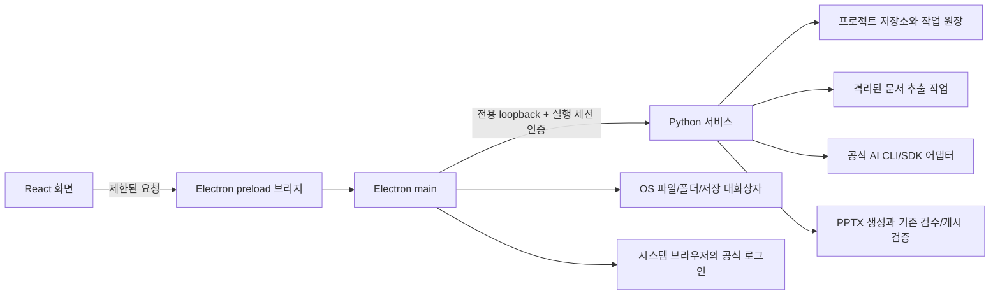

# 개정판 독립 앱 및 실행 구조 설계

> 2026-10-02 사용자 시안 수정 요청 반영: IR Pitch Deck, 보고 유형 드롭다운과 옆 예시 화면, 원하는 결과 네 가지 및 기타 직접 입력, 추천 근거·한계 보기 제거. 이번 변경은 시안과 설계 문서에 한정하며 제품 구현 완료를 뜻하지 않는다.

작성: 2026-10-02. [제품/UI 설계](../design/2026-10-02-revision-product-ux.md)의 구현 경계와 검증 관문을 정한다. 목표와 기술 선택을 적은 문서이며 최신 공식 CLI 기능, 계정 인증, 설치본 또는 새 문서 추출기를 이미 검증했다는 뜻이 아니다.

> 2026-10-02 추가 시안 수정: 동일한 3열 텍스트 예시는 보고 형식의 특징을 전달하지 못한다는 사용자 피드백으로 10종의 대표 페이지를 서로 다른 시각 구조로 교체했다. 편집 탭에는 직접 수정과 실행 취소/다시 실행을 추가했다. 아래 구현 계약은 제품의 후속 목표이며 이번 동작은 메모리 기반 시안이다.

## 1. 기본 기술 선택

기본안은 Electron 앱 창 + 기존 React 화면 + 기존 Python 서비스다. PPTX 생성, 저장, 근거/현재성/게시 검증을 재사용하고 UI와 프로세스 실행 책임을 분리한다. 단일 기술 전면 재작성보다 현재 검증된 출력 경로를 보존할 수 있다.

| 후보 | 장점 | 비용/검증점 | 판단 |
|---|---|---|---|
| Electron + React + Python | 같은 렌더링 엔진, 공식 OS 파일 대화상자, 기존 UI/코어 재사용 | 배포 용량/메모리, 두 런타임의 업데이트 | 기본안 |
| Tauri + React + Python | 작은 셸, OS WebView 활용 | Rust 계층 추가, OS별 WebView 차이, 별도 Python 패키징은 여전히 필요 | 크기/메모리 목표를 Electron이 못 맞추면 재검토 |
| pywebview + Python | Python 중심, 얇은 셸 | OS별 웹 엔진/브리지 차이, 배포/업데이트 구현 추가 | 예비안 |

Windows x64, macOS arm64와 x64를 정식 목표로 한다. Windows ARM 네이티브는 이번 목표에 포함하지 않으며 에뮬레이션 작동을 검증 없이 지원이라고 표시하지 않는다. 최소 OS 버전은 Electron/공식 AI 도구 지원표와 실제 기기 시험을 대조해 설치본 착수 전에 고정한다. Windows 11, macOS 현재 지원 버전에서 먼저 관통하고 지원 범위를 문서화한다.

## 2. 프로세스 및 접근 경계



렌더러의 Node 접근을 끄고 context isolation을 켠다. preload는 허용된 메시지와 형식만 전달한다. 임의 셸 실행, 임의 URL 또는 파일 시스템 전체 접근 API를 노출하지 않는다. 외부 문서와 인증 페이지는 앱 권한이 있는 렌더러에서 실행하지 않는다.

Python 서비스는 앱이 만든 loopback 포트와 실행마다 다른 인증값을 사용한다. 서비스 준비 신호에서 제품/버전/세션 소유권을 확인한다. UI는 패키지 내 자원만 읽고 요청은 main의 검증된 브리지를 거친다. 기존 Host/Origin/X-Requested-With 규칙을 해제하지 않고 desktop 전용 세션 검증을 추가한다. 기존 웹 개발 경로는 별도 모드로 유지한다. 생성의 AI 동의 검증은 새 로컬 동의 원장과 서버 검증으로 연결하며 단순 헤더 존재만으로 영속 동의를 대체하지 않는다.

첫 기술 관통은 파일 선택 → 합성 자료 가져오기 → 저장 → PPTX → 종료/재시작이다. UI가 다른 SlideCaptain 프로세스나 구버전 서비스에 잘못 붙지 않는지 확인한다. 종료 시 앱이 소유한 서비스/자식만 정리한다.

## 3. 설치, 업데이트와 기존 데이터

앱 자체 실행에는 사용자가 Python/Node를 별도로 설치하지 않게 한다. Python 의존성과 UI를 OS/CPU별로 빌드하여 포함한다. Python 서비스 패키징은 PyInstaller 또는 동등한 자체 포함 배포를 작은 관통에서 비교한다. Claude SDK의 번들 CLI 자원, 폰트, 네이티브 라이브러리, 생성 스키마 파일을 실제 설치본에서 검사한다.

공식 AI 도구는 재배포 허용 범위와 업데이트 계약을 먼저 확인한다. 허용되면 버전 고정하여 포함하고, 아니면 앱 내 최초 AI 연결 준비 화면에서 공식 설치 경로를 안내한다. 이 경우 앱의 자료/수동 편집/내보내기는 AI 도구 없이 작동한다. 셸 PATH와 Finder/시작 메뉴에서 실행한 앱의 PATH가 다르므로 네이티브 CLI 탐색을 별도로 검증한다.

사용자 데이터와 인증 프로필은 앱 설치 폴더 밖에 둔다. 기존 `~/slidecaptain-projects`는 자동 삭제하거나 이동하지 않고 최초 실행에서 발견한 경로를 제시한다. 새 형식으로 바꾸기 전에 복사/스냅샷과 되돌릴 경로를 확보한다. 첫 단위에서 추가한 보고 유형은 옛 0.2.0에서 읽히지 않을 수 있으므로 ‘옛 버전에서도 모든 새 문서를 열 수 있다’고 약속하지 않는다. 프로젝트 manifest의 파일 형식/최소 읽기 버전과 마이그레이션 기록을 사용한다. 이전 앱은 이전 복사본을 사용한다.

Windows 설치본과 macOS 설치본을 같은 기능 릴리스 관문으로 관리한다. 코드 서명/공증은 공개 배포 준비 때 안전한 설정으로 주입하며 비밀키를 저장소에 두지 않는다. 미서명 로컬 검증과 서명 배포 검증을 구분한다. 첫 개정판 업데이트는 자동 강제 갱신보다 사용자 시작 방식으로 하며 생성/내보내기 중 업데이트하지 않는다. 설치 실패 시 사용자 프로젝트는 남아야 한다.

## 4. 계정, 모델과 Effort 어댑터

현재 Claude는 OS 사용자의 기존 CLI 인증을 쓰며 모델 후보는 sonnet/opus/haiku 별칭 세 개로 고정되어 있다. Codex는 앱 전용 프로필 한 개와 `model/list`를 사용하지만 Effort 정보는 보존하지 않는다. 다음 계약은 새로 구현해야 한다.

| 모델 | 주요 필드와 의미 |
|---|---|
| AccountProfile | 로컬 불변 ID, 제공자, 사용자 별칭, 제공자가 확인한 계정 식별자/확인 시각, 연결 상태, 인증 저장 위치 참조. 토큰 값 제외 |
| ModelCapability | 공식 모델 ID/표시명, 해석된 정확 버전(알 수 없으면 null), 지원 Effort, 목록 출처, 확인 시각, 사용 가능 확인 범위 |
| AISelection | 프로필 ID, 모델 ID, Effort, 선택 리비전. 명시 선택과 추천 제안을 구분 |
| ConsentRecord | 프로필/검증된 신원, 제공자, 고지 버전, 전송 범위, 동의/철회 시각. 같은 이메일만으로 계정을 합치지 않음 |
| Recommendation | 작업 종류, 원하는 결과 유형/직접 입력 목적, 모델 버전/Effort, 근거 커밋/파일/표본/한계, 카탈로그 버전. 호출권한의 증거가 아님 |

계정 격리의 검증 관문: 로그인/상태/목록/생성/로그아웃이 모두 동일한 프로필을 사용하는가, 공식 도구에서 계정을 바꿨을 때 감지하는가, OS 자격 증명 저장소가 프로필을 합치지 않는가. 설정 파일 경로를 나눴다는 사실만으로 인증 격리를 선언하지 않는다. 공식적으로 격리할 수 없으면 해당 제공자의 다중 프로필 요구를 완료로 표시하지 않고 공식 로그아웃/로그인 전환 대안을 제시하여 범위를 재결정한다. 비공식 토큰 복사로 해결하지 않는다.

모델/정확 버전/권한/Effort는 제공자 공식 조회와 실제 전달 경로를 먼저 확인한다. 목록 조회가 권한 보증은 아니다. 정확 버전이나 Effort를 응답에서 확인할 수 없으면 요청값과 실제 확인값을 분리한다. 지원하지 않는 Effort는 요청 전에 막는다. model/list의 페이지 끝까지 조회하고 캐시 신선도와 계정 전환 시 무효화를 관리한다.

추천은 출시 시 포함하는 버전 있는 카탈로그를 사용하며 매번 GitHub를 조회해 앱 기본값을 바꾸지 않는다. 공급자의 모델 목록과 매칭되지 않은 추천은 사용할 수 없음으로 표시한다. 같은 별칭의 새 모델 버전은 실측 근거를 자동 상속하지 않는다. 사용자 변경을 추천이 덮어쓰지 않는다.

Google 로그인은 공식 제공자 인증 창에서 선택하는 경로다. Electron에 Google OAuth 비밀키를 추가하거나 계정 비밀번호를 받지 않는다. 브라우저 인증의 완료/취소/시간 초과와 회사 SSO 계정의 실제 가능 여부를 별도로 검증한다.

## 5. 문서 추출과 긴 입력

모든 가져오기는 원본 사본, 해시, 형식, 추출기 버전, 원문 위치와 추출 상태를 기록한다. 파일별 부분 성공을 표현하고 업로드 성공을 추출 성공으로 바꾸지 않는다. 추출기는 별도 프로세스에서 시간/메모리/압축 해제 크기 상한을 적용한다. 매크로와 문서 내 스크립트는 실행하지 않는다.

| 형식 | 1차 목표 | 명시할 한계/검증 |
|---|---|---|
| TXT/MD/CSV/XLSX | 현재 기능 유지, 긴 텍스트 직접 작성 | 인코딩, 수식 결과 없음, 시트/행 상한과 잘림 |
| PDF | 텍스트형 PDF의 페이지별 텍스트와 위치 | 읽기 순서/복잡한 표/스캔. 텍스트 없는 페이지를 완료로 숨기지 않음 |
| PPTX | 슬라이드별 텍스트/표/발표자 노트 | 그룹/도형 순서, 차트/그림 속 텍스트, SmartArt 누락 표시 |
| DOCX | 문단/제목/표와 원문 위치 | 변경 추적/텍스트 상자/머리말/각주 지원 범위. 고정 페이지 번호가 없음을 표시 |
| HWP | HWP 5 계열의 문단/표 및 위치 추출 | 암호/배포용/내장 객체/구형 형식, 라이선스와 macOS 동등 처리 |
| HWPX | XML 기반 문단/표 추출 | 압축 해제 상한, 참조 객체/그림/복잡한 표 |

PDF는 pypdf, PPTX는 기존 python-pptx, DOCX는 python-docx 등을 후보로 평가한다. HWP는 라이선스와 배포가 가능한 파서 후보를 실제 합성 문서로 비교한 뒤 선택한다. 한글 설치 또는 Windows COM에만 의존하는 경로는 두 OS 동등 지원의 기본안으로 채택하지 않는다. HWP가 검증되지 않으면 요구를 조용히 삭제하지 않고 기술 관문 미통과로 남긴다. 스캔 OCR은 별도 로컬 옵션을 목표로 하고 추가 구성요소/정확도/원문 연결 검증을 거쳐 활성화한다. 처음부터 스캔 PDF가 일반 텍스트 PDF와 동일한 정확도로 지원된다고 표시하지 않는다.

자료 메타데이터는 SourceDocument/SourceRevision/SourceSpan으로 구분한다. 기존 파일명+추출 행을 참조하는 근거는 원문 위치로 역추적할 수 있게 매핑을 추가한다. 새 리비전을 가져오면 기존 발췌와 계획은 보존하고 stale로 표시한다. 동일 파일명, 같은 내용 다른 이름, 심볼릭 링크/권한 거부, 원본 이동, 한글 정규화 차이, 대소문자 차이를 처리한다. 폴더는 기본적으로 하위 폴더 제외, 숨김/시스템/인증 파일 제외 목록을 보여 주며 문서 형식만 선택 가능하게 한다.

UI 입력 용량과 생성 문맥 용량은 분리한다. 20만 자 텍스트 붙여넣기 저장/복구를 검증하고 생성에는 제공자별 확인된 한도와 출력 여유를 적용한다. 초과 자료는 원문 위치가 연결된 분할 분석/요약 후보를 만들어 사용자가 포함 범위를 확인하게 한다. 중간 요약은 원문 대신 사실의 정본이 되지 않는다. 먼저 포함 자료 선택을 제공하고 분할 분석이 검증될 때까지 기존 생성 한도를 숨기거나 임의 확대하지 않는다.

## 6. 작업 원장, 취소와 복구

GenerationJob은 job ID, 입력 리비전/해시, 계정/모델/Effort/동의 리비전, 단계, 시도 수, 결과 후보 위치를 갖는다. 로컬 실행 상태는 SQLite 등 트랜잭션 가능한 앱 저장소에서 관리하고, 문서의 정본은 기존 프로젝트 파일에 유지한다. 둘 사이의 게시 전후 상태를 재시작 시 조정할 수 있어야 한다.

```text
queued → running → validating → succeeded
             ↘ cancel_requested → cancelled 또는 interrupted
             ↘ failed
재시작에서 실행 중으로 남은 작업 → interrupted/remote_completion_unknown
```

작업 시작은 요청 ID로 중복 클릭을 병합한다. 공급자가 멱등 호출을 지원하지 않는 경우 원격 실행을 정확히 한 번이라고 보증하지 않는다. 계정/모델 선택과 입력은 실행 시 고정한다. 대기 작업도 계정 변경으로 조용히 재바인딩하지 않고 시작 전 현재성/동의 재검증 후 재확인을 요구한다. 같은 프로젝트의 충돌 작업은 직렬화한다.

실행 중 사용자의 목적/자료 포함 범위/본문 편집은 허용한다. 후보는 생성 기준 리비전과 현재 리비전을 모두 표시하며 다르면 이전 입력 기준 후보로 남긴다. 적용 직전 서버가 ETag와 입력/자료 fingerprint를 다시 비교하고 불일치 시 적용하지 않는다. 현재 편집은 유지하고 후보 읽기 또는 현재 입력으로 재생성하는 경로를 제공한다. 늦게 도착한 성공 응답이 새 편집을 덮지 않는 회귀를 필수 수용 시험으로 둔다.

> 2026-10-10 정정(D3 계획 4.4, 사용자 결정): 위 문단의 실행 중 편집 허용은 장 생성 묶음에 한해 좁힌다. 묶음 중에는 같은 프로젝트의 덱 편집을 읽기 전용으로 두고, 장 단위 저장으로 풀지는 D3c에서 다시 판단한다. 앞 문단의 "같은 프로젝트의 충돌 작업은 직렬화한다"는 대기열 없이 409 거절로 유지한다(D2b 9절 5항, D3 계획 4.4). 대기열은 대기 작업의 재바인딩 검사를 새로 만들고, 이동과 편집이 허용되면 한 번에 한 작업이라는 제약이 사용자를 막지 않기 때문이다. 또 구조안 후보는 지금 반영 직전 서버 재비교가 없으며 D3a-5가 화면의 반영 직전 재조회로 보강한다.

원격 호출이 끝났고 로컬 후보가 저장된 경우 재호출 없이 검증/적용을 재개한다. 응답 보존 전에 종료되어 원격 완료 여부가 불명확하면 그 사실을 표시하고 사용자가 다시 생성할 때만 새 호출한다. 성공한 장 결과와 실패한 장 결과를 구분한다. 형식 재시도 1회, 시간/출력 한도와 제공자 오류 상한을 공통 실행 정책으로 관리한다. 재시도마다 입력 보존/사용량 기록/동의 검사 경로를 우회하지 않는다.

저장 중 종료, 강제 종료 직전 완료, 취소 응답 지연, 계정 만료, 자료 수정과 결과 도착 경합을 테스트한다. 취소 요청은 완료와 다르며 이미 전송된 요청이 취소됐다고 추정하지 않는다. PPTX 게시/내보내기는 기존 잠금, 원본 identity/hash, 리비전과 제출 자격 검증을 유지한다.

## 7. 개발 순서와 완료 관문

| 단계 | 산출물 | 관련 요구 | 다음 단계로 넘어가는 기준 |
|---|---|---|---|
| D0 설계 | 제품 흐름, 상태표, 화면 시안, 기술 관문 | 전체 | 원본 15개 요구와 후속 R16 연결, 독립 설계 리뷰 반영 |
| D1 기술 관통 | 양 OS 셸/서비스/파일 선택, 계정 격리/목록/Effort 조사, HWP 추출 실험 | R02/R04~R08/R10 | 실제 가능한 공식 경로와 미지원 경계 확정. 위험한 세 축을 UI 구현 전에 확인 |
| D2 공통 기반 | 디자인 토큰/컴포넌트, 프로젝트 상태/저장/작업 원장, 데이터 이전 | R01/R02/R11 | 변경/저장/충돌/중단 복구 상태를 모의 서버와 실제 저장으로 검증 |
| D3 보고 흐름 | 목적별 입력/패턴, 구성/편집/검토 5단계, 사용량 문구 정리 | R01/R09/R11/R12/R15/R16 | IR 포함 10유형 저장/생성/편집 보존, 드롭다운/시각 구조가 다른 대표 페이지, 직접 요소 편집/저장/PPTX 일치, 긴 작업 중 이동/취소와 실패 재개 |
| D4 AI 연결 | 공식 계정 프로필, 모델/Effort, Google 경로 안내, 한 번 동의, Claude 추천 | R03~R07/R14 | 두 계정 전환/재시작/철회, 실제 요청 설정 대조, 근거/가용성 불일치 처리 |
| D5 자료 확장 | 문서 파서/폴더 미리보기/긴 텍스트/원문 추적 | R08/R10/R13 | 양 OS 동일 합성 자료, 부분 실패/중복/변경/대용량/포터블 프로젝트 검증 |
| D6 개정판 수용 | 설치/업데이트/재시작, 실제 보고 생성/PowerPoint/사용자 사용성 검증 | 전체 | 기능 체크와 별도로 내용 품질/사용 흐름/OS 표시 확인. 미완료는 명시 |

D3~D5는 D1/D2의 확정 계약 위에서 분리하여 개발할 수 있으나 앱 전체 상태와 저장은 공통이다. 일정은 D1에서 공식 CLI와 HWP/패키징 범위가 확인된 뒤 작업량으로 산정한다. 확인되지 않은 위험을 숨긴 출시 날짜를 정하지 않는다.

## 8. 요구사항별 추적 및 수용 시험

| 요구 | 구현 중심 | 필수 확인 |
|---|---|---|
| R01 | 공통 단계/상태/저장 컴포넌트 | 색 없이도 상태 구별, 현재/완료 분리, 좁은 창/확대/키보드 |
| R02 | desktop 셸/서비스/패키징 | 양 OS 깨끗한 설치, 재실행, 종료, 데이터 보존 |
| R03 | 버전 있는 추천 카탈로그 | 작업/목적/가용 모델 매칭, 기타 입력 보존, 수동 선택 보존, 내부 근거 관리 |
| R04 | 공식 모델 목록/정확 버전 | 별칭 미확인, 목록 갱신, 실제 요청/응답 모델 구분 |
| R05 | Effort 지원표/호출 전달 | 미지원 값 차단, 저장/재시작/요청 전달, 실제값 미확인 표현 |
| R06 | 프로필/선택/lease | 회사/개인 전환, 실행 중 고정, 다른 CLI 로그인 변경 감지 |
| R07 | 공식 브라우저 로그인 | Google 경로 제공 여부, 완료/취소/만료, 계정 식별 |
| R08 | 형식별 추출 어댑터 | PDF/PPTX/DOCX/HWP/HWPX 텍스트/표/위치, 누락/암호/손상 |
| R09 | 목적 정보/보고 패턴/생성 맥락 | IR 포함 10유형별 다른 구성/예시, 누락 정보 창작 금지, 기존 편집 보존 |
| R10 | OS 대화상자/가져오기 | 하위 폴더/선택 제외/중복/권한/한글 경로, 원본 미변경 |
| R11 | job/검증 오류/재시도 | 입력 보존, 특정 원인 안내, 1회 형식 재시도, 중복 실행 방지 |
| R12 | 작성 화면/진단 상세 | 토큰/비용 문구 기본 화면 제거, 내부 기록 유지 |
| R13 | 텍스트 자료 편집/초안 저장 | 파일명 선입력 없음, 20만 자/재시작, 생성 한도와 구분 |
| R14 | 프로필별 영속 동의 | 같은 계정 재시작 반복 질문 없음, 계정/범위 변경/철회 |
| R15 | 구성 입력 | 주안점 명칭, 요청 전달과 저장/오류 후 복구 |
| R16 | 캔버스 직접 수정/사용자 변경 저장 | 텍스트·위치·크기·색·삭제/되돌리기, 장별 저장/재열기, 재생성 보존, 미리보기/PPTX 일치 |

대표 종단 시나리오는 새 주간 보고 작성, 월간 비교 자료 부족, 리서치 출처 충돌, 프로젝트 진행 보고, 회사/개인 계정 전환, 로그인 취소, 긴 텍스트 초과, 폴더 부분 실패, HWP 미지원 변형, 생성 중 종료, 저장 충돌, 내보내기 중 오류의 12종이다. 정상 상태만 확인하지 않는다.

실제 품질 비교는 합성 주간/프로젝트/리서치 3종을 기존/개정 두 버전에서 동일 입력으로 반복하는 계획으로 별도 실행 예산을 산정한다. 전체 호출 수/시간/비용 상한과 모델 버전을 실행 전에 정하며 과거 호출 승인을 재사용하지 않는다. 이번 설계 작업의 실제 AI 호출은 0회다. Windows와 macOS에서 표시/파일 접근을 직접 확인하고, PowerPoint 내용/편집성과 사용자 평가를 자동 테스트 결과로 대체하지 않는다.

## 9. 확인되지 않은 가정과 처리

2026-10-02 D1 후속: Linux 독립 앱과 자체 포함 서비스의 실제 실행, 공식 카탈로그 metadata와 HWP/HWPX 합성 본문·표를 검증했다. [D1 인계](../handoffs/2026-10-02-desktop-d1.md)가 확인된 범위와 라이선스 후보를 기록한다. 아래 양 OS 프로필/패키징과 실제 문서 가정은 아직 완료가 아니다.

- Claude의 공식 다중 인증 프로필과 계정별 정확 모델/Effort 조회는 D1의 필수 조사다. 미지원이면 동일 UI를 허위로 채우지 않는다.
- 공식 CLI 재배포 가능 범위, OS별 서명/공증과 CPU 지원은 패키징 실험 및 공식 문서로 확정한다.
- HWP/HWPX 추출 범위와 라이선스는 실제 샘플 평가 후 고정한다. 전체 문서의 화면 재현을 텍스트 추출 성공으로 주장하지 않는다.
- 모델 실측은 외부 작업 격자의 소표본이며 이 앱의 개선 품질 보증이 아니다. 실제 가용 버전과 일치하지 않으면 추천을 보류한다.
- 로컬 프로세스 강제 종료 뒤 원격 호출의 완료 여부는 알 수 없을 수 있다. 자동 재호출 대신 상태를 설명하고 선택을 남긴다.

## 10. 직접 수정 데이터 계약 (R16)

2026-10-02 후속 사용자 요청으로 채택한 목표 계약이다. 현재 HTML 시안은 한 장의 텍스트/도형을 메모리에서 수정하고 실제 프로젝트 파일이나 출력 모델을 변경하지 않는다.

제품의 직접 수정은 안정적인 element ID와 장 ID를 사용하며 텍스트/도형 종류, 논리 좌표·크기, 글자 크기·색/도형 색, 원래 의미 입력 참조, 사용자 변경 여부를 기록한다. 위치와 글자 크기는 화면 확대율과 별개인 슬라이드 좌표로 저장하고 미리보기/PPTX가 같은 변경값을 소비한다. 내용과 표현 변경은 원문 자료를 수정하지 않는다. 기존 Deck/Diagram의 의미 필드와 요소별 표시 변경을 연결하고 새 저장 버전의 이전/이후 복구를 정의한 뒤 스키마를 확정한다. HTML 좌표를 제품의 저장 형식으로 그대로 승인한 것은 아니다.

텍스트 편집, 드래그 이동, 속성 변경, 삭제는 명령 단위로 기록한다. 하나의 드래그는 하나의 실행 취소 단위이고 인라인 세션 중 반복 더블클릭은 처음 수정 전 스냅샷을 보존한다. 포커스와 선택 대상이 같아야 하며 입력 중 Delete/방향키/되돌리기를 캔버스 단축키로 가로채지 않는다. 저장은 기존 ETag 충돌/미저장 보호 계약을 따른다. 장 변경·모드 종료·앱 종료와 경합해 변경을 잃지 않게 한다.

단순 위치/서식 변경도 출력 fingerprint를 바꾸므로 해당 표시 검토의 현재성을 무효화한다. 문구/필수 내용/근거 표시 삭제는 연결된 내용 검토도 다시 요구한다. 도식의 구성 요소를 삭제해 의미/관계 계약이 깨지면 기본 검증을 완화하지 않고 변경의 범위와 확인 필요 항목을 표시한다. 보호 근거나 계획 연결을 도형 삭제의 부수 효과로 조용히 제거하지 않는다.

AI 재생성은 현재 사용자 변경과 별도 후보를 만들고 덮어쓰기 전에 비교한다. 사용자가 선택한 적용 범위만 반영하며 수정해 둔 문구·도형 위치·크기·색을 보존한다. 서버 저장/새로고침/장 전환/실패 후 복구, 한글 입력·여러 줄·붙여넣기, 확대된 창의 좌표 변환, 키보드/드래그/취소, 삭제 복구와 실제 PowerPoint 출력 대조를 D3 수용 관문으로 둔다.
