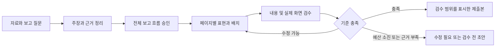

# SlideCaptain 품질 중심 제품과 서비스 기획

작성: 2026-09-12. 사용자 승인: 핵심 원인과 개선 방향을 채택하고 설계 및 개발을 진행한다. 이 문서는 목표 요구사항이며 구현 완료 선언이 아니다.

관련 진본: [기존 설계서](2026-08-27-mvp-design.md), [아키텍처](../architecture/2026-09-12-quality-pipeline.md), [개발 계획](../plans/2026-09-12-quality-first-rebuild.md).

## 1. 문제와 제품 약속

대상 사용자는 자료와 요청을 제시하고 업무 보고서를 만드는 비개발자다. 보고를 받는 사람은 핵심 판단, 근거, 조건, 다음 행동을 쉽게 이해해야 한다. 현재는 자료를 제한된 슬롯으로 변환하는 기능에 비해 보고 논리, 표현 선택과 완성본 검수가 부족하다.

사용자가 제시한 비교 보고서 두 개의 사용자 평가는 약 30/100이다. 이들은 실패 분석용 기준이지 목표 디자인이나 정답 덱이 아니다. 공개 저장소에는 회사 원문, 파일명, 내부 인명, 수치와 스크린샷을 저장하지 않는다. 실제 최신 빌드의 우위는 동일 조건 비교 전까지 미확인이다.

제품의 약속은 '항상 특정 점수'가 아니라 검수 가능한 품질 기준, 실패의 명확한 표시, 편집 가능한 결과와 낮은 제출 전 수정 부담이다. 제품이 검수하지 못한 결과를 제출 가능하다고 표시하지 않는다.

## 2. 목표와 비목표

- 보고 목적, 핵심 주장, 근거와 요청 사항이 연결되는 전체 흐름을 만든다.
- 수치의 주체, 단위, 기간, 분모, 산식을 보존하고 사실과 가정을 구분한다.
- 텍스트, 표, 차트, 관계도, 이미지 중 독자의 이해에 적합한 표현을 선택한다.
- 지정된 읽기 환경에서 정보 위계, 정렬, 강조, 여백과 균형을 유지한다.
- 일반 에이전트 대비 독자의 이해도와 제출 전 수정 부담을 개선한다. 개선량은 측정 전까지 미확인이다.
- 이번 범위에서 무제한 자유 캔버스, 임의 코드 실행, 모든 차트 유형, 자동 이미지 양산, 계정/결제/SaaS 전환은 하지 않는다.
- 사용자의 100점 평가를 시스템이 추정하거나 LLM 자기 평가로 대체하지 않는다.

## 3. 서비스 흐름

| 화면/단계 | 사용자의 핵심 행동 | 제품의 책임 | 실패와 빈 상태 |
|---|---|---|---|
| 자료와 목적 | 자료, 독자, 보고 질문, 읽기 환경 입력 | 기존 정보로 초안을 제안하고 중요한 미정만 질문 | 자료 누락, 추출 잘림, 지원하지 않는 형식 표시 |
| 근거와 흐름 | 핵심 판단과 보고 순서를 승인 | 주장별 출처, 가정, 비교 가능성, 논리 누락을 보여 줌 | 근거 없는 주장은 보류하거나 가설로 표시 |
| 표현과 편집 | 의미, 강조, 표현 종류를 수정 | 적절한 구성요소 조합과 가독성 기준을 계산 | 불가능한 표현을 조용히 불릿으로 바꾸지 않음 |
| 검수 | 문제와 수정 제안을 확인 | 전체 보고와 실제 페이지를 검수하고 변경 영향을 구분 | 실행되지 않은 검수는 미수행으로 표시 |
| 내보내기 | 초안 또는 제출본 선택 | 현재 리비전과 검수 결과를 결합하고 원본을 보존 | 실패 시 초안 유지, 검수 통과 위조/낡은 판정 거절 |

기존 자료/구조안/편집 화면을 점진적으로 확장한다. UI를 먼저 완성한 다음 생성 계약을 바꾸지 않는다. 긴 작업에는 단계, 호출 수, 취소, 실패 원인과 재개 지점을 보여 준다. 파일 생성과 제출 승인 상태를 분리한다.

## 4. 사용자 이야기와 수용 기준

| 우선순위 | 요구 | 수용 기준 |
|---|---|---|
| P0 | 보고 목적에 맞는 흐름 | 합의한 질문에 답하는 장이 있고 요약과 본문이 모순되지 않는다 |
| P0 | 근거 연결 | 중요 주장에 출처 위치 또는 가정 표시가 있다. 다른 지표를 동일 기준으로 비교하지 않는다 |
| P0 | 의미에 맞는 표현 | 표현 선택 이유가 있고, 차트 데이터와 도식 관계를 원본 정보에 연결한다 |
| P0 | 읽기 환경별 배치 | 선택한 프로필의 최소 글자 크기와 여백을 지킨다. 넘치면 재배치/분리/부록/축약을 검토한다 |
| P0 | 완성본 검수 | 실제 출력의 내용과 화면을 평가한다. 대상 0건과 미실행은 통과가 아니다 |
| P0 | 편집 안전성 | 변경 범위의 검수만 무효화하되 전체 요약과 근거에 영향을 주면 전체 검수를 다시 요구한다 |
| P0 | 제한된 수정 | 승인된 호출/시간/비용 상한에서 수정하고 미해결은 보류한다. 필수 검수 예산을 생성에 소진하지 않는다 |
| P0 | 명확한 내보내기 | 초안과 제출 가능 상태를 분리하고 서버도 현재 리비전과 판정 근거를 검사한다 |
| P0 | 데이터 보호 | 원문은 로컬 유지, AI 전송 고지 준수, 검수용 이미지 전송도 별도 범위로 고지한다 |
| P1 | 의미 있는 이미지 | 해상도, 출처/사용 권한, 자르기와 스타일을 관리한다. 불필요하면 사용하지 않는다 |
| P1 | 재사용 | 검수된 구성요소와 사용자가 승인한 프리셋을 재사용한다. 실패 사례로 기준을 갱신한다 |
| P2 | 상업화와 확장 | 반복 품질과 실제 고객 가치를 확인한 후 결정한다 |

원자료가 부족한 경우의 좋은 결과는 그럴듯한 결론이 아니라 무엇이 미확인이고 어떤 확인이 필요한지 알 수 있는 보고서다. 수동 편집한 내용과 검수 결과도 원문을 덮어쓰지 않고 버전으로 남긴다.

## 5. 품질 계약

| 영역 | 독자 또는 검수자가 답할 질문 | 통과하지 못하는 예 |
|---|---|---|
| 보고 흐름 | 무엇을 판단해야 하며 왜 이런 순서인가? | 요약과 본문의 결론이 다름, 주요 근거 누락 |
| 내용 정합성 | 수치와 주장의 근거, 조건, 가정이 명확한가? | 기간/분모 혼합, 계산 오류, 인과 과장 |
| 표현 적절성 | 관계나 변화가 가장 이해하기 쉬운 방식으로 표현됐는가? | 관계 설명을 긴 목록으로만 제시, 비교 불가 수치를 차트화 |
| 가독성 | 지정한 환경에서 우선순위와 읽는 순서가 보이는가? | 작은 글자, 정렬 불일치, 잘림, 불필요한 강조 |
| 제출 준비도 | 다시 구성하거나 크게 재배치하지 않고 제출할 수 있는가? | 핵심 페이지 재작성 필요, 실제 앱에서 표시 미확인 |

치명적 오류는 0건이어야 한다. 다른 페이지의 좋은 점수로 상쇄하지 않는다. 자동 검사는 분량/구조 같은 확인 가능한 범위만 통과로 기록하고, 의미와 시각 판단은 별도 근거를 남긴다. 임의의 통합 100점 수치를 기본 품질 계약으로 쓰지 않는다.

측정 항목은 독자 이해 질문의 응답, 기준별 사람 판정, 최저 품질 페이지, 제출까지의 실제 수정 시간, AI 호출과 비용, 실패/보류율이다. 도형 수, 색상 수, 템플릿 다양성, 테스트 수는 성공 지표가 아니다.

## 6. 비교 실증

같은 요청, 자료, 읽기 환경과 출력 조건으로 일반 에이전트, 기존 SlideCaptain, 개선 버전을 비교한다. 제작 방식을 가리고 평가하며 실제 모델 버전, 설정, 반복 횟수, 제작 시간, 비용과 수작업을 기록한다. 각 시스템의 정상적인 도구 사용은 허용하되 조건 차이를 기록한다.

대표 사례 3건으로 평가 기준을 보정한 뒤 미사용 자료와 경계 사례로 확대한다. 동일 덱의 버전 두 개를 독립 사례 두 건으로 세지 않는다. 실패와 보류도 분모에 포함한다. 3건 통과는 초기 실증이지 일반적인 품질 보증이 아니다.

초기 검증 가설은 '중요 오류 없이, 일반 에이전트보다 읽기 쉽고 수정량이 적다'이다. 정량 개선 목표는 기준선 측정 후 사용자와 확정한다. 미확정 상태를 통과로 처리하지 않는다.

## 7. 현재와 목표의 구분

Q1a에 반영한 것은 생성 지침, 다른 장 초안 맥락, 구조/용량 사전 점검, 입력과 PPTX 해시가 포함된 점검 기록, 초안 안내와 CLI다. Q1a에서는 생성 스키마와 기존 덱 버전을 변경하지 않았다.

2026-09-12 개정: Q2a 첫 태스크에서 선택적 보고 질문, 원문 위치와 주장별 근거, 핵심 판단/장 역할/미확인 질문을 구조안 생성과 승인, 저장, 장 생성에 연결했다. 계획 입력이 바뀌면 생성 전에 재계획을 요구하고 편집한 덱과 기존 계획은 저장에 보존한다. 구체 계약은 [아키텍처](../architecture/2026-09-12-quality-pipeline.md)의 Q2a 실제 계약을 따른다.

2026-09-12 Q2b 개정: 선언된 비교의 지표 정의/단위/주체/기간/분모 조건을 대조하고 불가/정보 부족 사유를 생성 계획, 저장과 화면에 연결했다. 입력 조건의 일치는 의미상 올바른 비교라는 보증이 아니다. 비교 대상 0건은 미검사로 표시한다.

Q2b 종료 시점에는 계산과 의미/시각 검수, 수정 루프, 검수 상세가 미구현이었다. 당시 Q2b의 백엔드/프런트 테스트와 빌드, API 계약 및 별도 임시 앱 HTTP 검사는 통과했다. 브라우저 조작은 도구 연결/창 접근 오류로 미수행이며 실제 AI 산출물과 PowerPoint 표시도 미검증이다. 읽기 품질이 개선됐다고 판정하지 않는다. 검증 범위는 [Q2b 인계](../handoffs/2026-09-12-q2b-metric-comparison-handoff.md)에 기록했다.

2026-09-13 Q2c/Q2d 개정: 지원 비교의 차이/증감률과 퍼센트포인트를 계산하고 계산 불가 사유를 표시한다. Q2d의 편집 화면은 코드가 작성한 계산 기준 문구 전체와 현재 초안을 대조한다. 원문 파일/행/발췌와 두 근거 ID를 확인하며 부호/단위/기준 등이 다른 문구와 연결되지 않은 수치는 확인 필요로 남긴다. 자료/계획 변경과 대상 0건은 미수행이며 초안을 자동 수정하지 않는다. Chrome 정상/오류/무효화/낡은 원문 표시를 확인했다. 검증 범위는 [Q2d 인계](../handoffs/2026-09-13-q2d-numeric-review-handoff.md)를 따른다.

2026-09-13 Q1b 첫 단위 개정: 내보내는 초안과 현재 원문으로 계산 문구를 다시 대조하고 같은 버전의 품질 기록/PPTX와 API 응답에 연결한다. 화면은 내보낸 초안의 검사 수, 미수행 사유와 확인 필요 문구를 표시한다. 자료가 바뀌면 품질 식별값도 바뀌며 대상 0건과 낡은 자료를 통과로 바꾸지 않는다. 범위와 증거는 [Q1b 첫 단위 인계](../handoffs/2026-09-13-q1b1-export-quality-handoff.md)를 따른다.

2026-09-13 Q1b 두 번째 단위 개정: 웹과 CLI가 같은 출력 폴더에 동시에 저장해도 서로 다른 버전을 사용하며 기존 파일을 덮어쓰지 않는다. 저장 실패 뒤 남은 기록의 버전은 재사용하지 않고 대기 시간이 길어지면 재시도를 안내한다. macOS의 별도 프로세스와 실제 HTTP/CLI 검증 범위는 [Q1b 두 번째 단위 인계](../handoffs/2026-09-13-q1b2-export-publication-handoff.md)를 따른다. Windows 실기기 검증은 남아 있다.

2026-09-13 Q1b 세 번째 단위 개정: 검수 이력에서 저장 당시 점검과 조회 시점의 파일/현재 저장본 대조를 분리한다. 파일 누락, 변경, 기록 손상/결손과 구형 기록을 숨기지 않는다. 덱이 손상된 프로젝트도 과거 기록에 접근하며 미저장 자료는 저장 후 이동하도록 보호한다. 읽기 전용 조회는 기록이나 초안을 수정하지 않고, 외부 앱 변경은 새로고침으로 다시 확인한다. 독립 코드 리뷰와 macOS 검증 범위는 [Q1b 세 번째 단위 인계](../handoffs/2026-09-13-q1b3-export-history-handoff.md)를 따른다. Windows 실기기/새 CI는 미검증이다.

문구 일치는 원문 해석, 모델이 추출한 조건의 진실성, 자유로운 자연어의 의미나 보고서 품질을 검증하지 않는다. 미등록 비교/산식의 의미상 탐지, 요약 정합성, 단위 환산, 표현 중간 모델과 네이티브 차트, 산출물 독립 검수, 실제 렌더 검수와 수정 루프는 남아 있다.

## 8. 미정 사항

- 사용자/제품: 읽기 환경별 실제 합격 예시와 기준선 수정 시간. 초기 비교에서 보정한다.
- 기술: PowerPoint 목표 버전과 자동 렌더가 가능한 기기. 미확인 상태를 Keynote 결과로 대신하지 않는다.
- 제품/기술: 품질 향상 대비 허용 호출 수와 소요 시간. 외부 실호출 전에 범위와 상한을 승인받는다.
- 디자인: 처음 지원할 차트와 관계도 조합. 대표 보고서의 의미에 맞춰 좁게 선택한다.

## 2026-09-13 AI 연결 요구 추가

사용자는 Claude와 ChatGPT를 선택하고 공식 브라우저에서 로그인한 뒤 이용할 언어모델을 저장할 수 있어야 한다. 연결 상태, 로그인 진행, 모델 선택과 최근 생성 성공은 구별해 표시한다. 서비스·모델 변경 시 전송 대상을 다시 확인하고 형식 재시도나 자동 축약 중에는 변경하지 않는다. 구독 사용 한도를 API 결제나 웹 채팅 한도와 동일하다고 설명하지 않는다.

현재 로컬 구현과 배포 프로필의 조건은 [AI 연결 설계](../architecture/2026-09-13-ai-connections.md), 검증 결과는 [인계](../handoffs/2026-09-13-ai-connections-handoff.md)를 따른다. 두 제공자의 호출 성공을 내용·시각 품질 통과로 대신하지 않는다.

## 2026-09-13 Q3a 구현 범위 정정

도식의 의미와 근거 참조를 보존하는 독립 DiagramSpec 계약과 합성 fixture를 구현했다. 기존 앱에서 도식을 생성하거나 편집/내보내는 기능은 아직 없다. 계약의 구조 검사와 실제 보고서 품질을 구분하며 배치, 화면/PPTX 표시, 원문과 관계 의미 검수는 다음 단위로 남긴다. [단위 인계](../handoffs/2026-09-13-q3a-diagram-contract-handoff.md)에 로컬 검증과 미완료를 기록한다.

## 2026-09-13 Q3b 구현 범위 정정

Q3a 도식에서 한 줄의 인접 관계를 배치하는 첫 계산 어댑터를 구현했다. 노드 본문, 추정/제안/미확인 구분과 조건, 관계 방향과 근거를 보존한다. 공간 부족과 미지원 입력은 배치 불가로 반환한다. 이번 정정은 배치 계산 완료와 사용자가 앱에서 도식을 보는 기능을 구분하기 위해서다. 실제 화면/PPTX/생성 연결과 독자 품질은 아직 미구현/미검증이며 [Q3b 인계](../handoffs/2026-09-13-q3b-diagram-layout-handoff.md)가 현재 검증 범위를 관리한다.

## 2026-09-13 Q3b 공통 렌더 단위 결과

[렌더 계획](../plans/2026-09-13-q3b-diagram-render.md)과 [최신 인계](../handoffs/2026-09-13-q3b-diagram-render-handoff.md)에 따라 공통 문구를 포함한 도식 RenderPlan을 기존 Preview와 편집 가능한 PPTX 라이터에 연결했다. 이번 개정은 배치 계산, 두 소비자의 구조 정합과 실제 보고서 품질을 구분하기 위해서다. 원래 의미 입력에서 재계산하며 노드/관계/근거/조건, 좌표/줄바꿈/폰트/선/화살표를 보존한다. 기존 Deck/StoryPlan/저장 버전과 일반 템플릿은 유지하고 출력 스키마와 생성 타입을 갱신했다. 빈 도식 필드로 기존 품질 fingerprint가 바뀌지 않도록 했다.

백엔드 1,456개 통과/Windows 전용 1개 미실행, 프런트 316개와 타입/빌드를 확인했다. Chrome에서 번들 regular/bold를 로드한 합성 3개와 PPTX XML/재열기/텍스트 수정을 확인했다. 독립 리뷰의 수치 표현 범위와 공통 문구 overflow를 반영했고 최종 필수 수정은 0개다. 앱의 도식 저장/편집/생성 연결과 검수 만료, 실제 AI/목표 PowerPoint/독자 품질은 남는다. 다음은 의미 입력 저장과 미리보기 연결의 첫 단위다.

## 2026-09-20 프로젝트 도식 저장/읽기 전용 미리보기

저장된 도식을 프로젝트에서 다시 열고 읽기 전용 미리보기로 확인하거나 일반 페이지와 함께 초안 PPTX로 내보낼 수 있다. 장 순서를 바꾸면 페이지 번호와 배치를 다시 계산하고, 배치 불가는 오류로 안내한다. 기존 내용과 근거를 잃는 템플릿 전환/AI 재생성은 아직 제한한다. UI에서 새 도식을 만드는 기능은 다음 단위다.

검증은 백엔드 1,486개 통과/Windows 전용 1개 미실행, 프런트 323개, 타입/빌드, 독립 리뷰와 실제 내장 브라우저 합성 2개다. 기존 저장본 3개의 직렬화/품질 fingerprint를 유지했다. 실제 AI/목표 PowerPoint/독자 품질과 검수 승인 저장은 미완료이며 [최신 인계](../handoffs/2026-09-20-q3b-project-diagrams-handoff.md)를 따른다.

## 2026-09-27 기존 편집을 보존하는 계획 재작성

저장된 계획에서 질문과 일반 장의 주장/근거, 장 순서를 다시 작성하고 미리보기 뒤 명시적으로 적용할 수 있다. 기존 장 ID/제목/템플릿과 본문/도식은 유지하며 보호 도식의 주장/근거/비교/산식은 바꾸지 않는다. 보호 근거의 원문 변경은 생성 전에 차단한다. 후보 생성 이후 자료나 덱 변경은 적용 전에 다시 검사하고, 저장 충돌에서는 후보를 보존한 채 적용을 막는다.

이 기능은 새 계획과 기존 본문의 의미 정합성을 입증하지 않는다. 본문 재검토 안내를 적용 뒤에도 남기고 제출본 관문은 유지한다. 자동 장 추가/삭제, 본문 재생성과 보호 근거 이전은 후속이다. 개정 사유는 직전 복구 안내에서 제시한 계획 재작성 경로를 구현한 것이다. [인계](../handoffs/2026-09-27-story-plan-rewrite-handoff.md)와 [QA 보고서](../qa/2026-09-27-story-rewrite-full-qa.md)의 실행/미실행 구분을 따른다.

## 2026-09-29 새 도식 AI 초안

현재 보고 계획의 주장과 역할을 골라 새 도식의 항목/관계 후보를 요청할 수 있다. 선택한 주장과 등록 발췌만 전송하고 서버가 구조와 허용 근거를 검사한다. 후보를 별도로 검토해 작성 폼에 불러온 뒤 기존 배치 검사와 명시적 적용을 거친다. 제목/역할/주장과 기존 편집은 보존한다. 후보 생성은 저장이나 의미/제출 품질 승인이 아니다.

생성 도중 저장본/자료가 바뀌면 후보를 거절하고, 형식 재시도는 최대 1회다. 모델 변경 잠금과 전송 동의/usage를 유지한다. 기존 도식의 AI 교체, 새 주장/근거 생성과 Q4 검수 승인은 제공하지 않는다. 480px 반응형과 동의창 포커스를 포함한 로컬 검증 범위는 [최신 인계](../handoffs/2026-09-29-diagram-ai-draft-handoff.md)를 따른다. 실제 AI와 목표 PowerPoint/독자 품질은 미검증이다.
